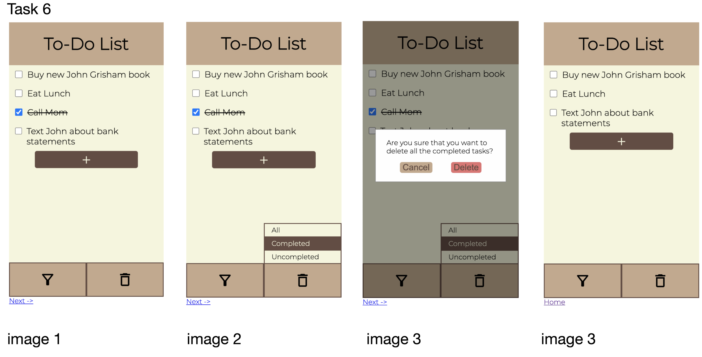

# Design for Each Task
In this lab, we are creating a mobile web app that manages a list of items to complete. Listed below are the specific tasks 
that our app can execute. Our primary principle for our app design is "simplicity". Because writing down items to-do might 
already be stressful, we want to reduce the amount of steps and elements required to complete each step. Following this idea, 
we also picked a neutral, non-intrusive, non-distracting color scheme for the app so that the colors do not add additional 
noise and stress.

## Task 1: Add New Item to Empty List
### Design Ideas / Decisions
For this task, we considered creating a pop-up for each time that a new item were to be added. First, the user could click 
the add button, which is a plus sign on the button for simplicity, in the upper half of the screen, and then a pop-up would 
appear like a modal. There would be a text area to type in and a blinking cursor to allow the user to visualize where they 
would be typing. They could then click outside the box to go back to the main screen and view the newly added item.

### Design Update Since Lab 2
With ReactJS, we wanted to make it convenient for users to begin creating their item after clicking the add button. In an 
empty list, creating a new item would automatically focus the cursor on the text area of the new item so that the user does 
not need to click the text area before typing. It prevents users from accidentally trying to type before the text area is 
selected and in the typing mode.

### Final Design

We decided to ditch the pop-up idea for creating a new item from an empty list (as well as the new items following)
because it seemed unnecessary and not suitable for the action. Instead, we begin with no new items and a line of text that 
indicates no new items have been added. A new item would be added by clicking the add button, as planned before, and
then the user could type directly next to a checkbox on the to-do list.

## Task 2: Add New Item to Non-empty List
### Design Ideas / Decisions
The idea for this task is very similar to what we came up with in adding new items to an empty list. The user could begin 
adding an item by clicking the add button which appears under all the existing items, in this case. Then, a blinking cursor 
would appear by the new checkbox to indicate that the user can begin typing the new item, along with a keyboard rising from 
the bottom of the screen. Tapping out of the item text area would take the cursor and keyboard away.

### Design Update Since Lab 2
Adding a new item to a non-empty list is similar to adding a new item to an empty list, except that in the case where the 
item list surpasses the screen size constraints, we made it so that the list would automatically scroll down to the bottom 
of the list. This allows the user to avoid having to scroll and struggle in order to find where they can type their new item.

### Final Design

The final design for this task ended up being what we discussed in the Design Ideas / Decisions of this task, which is 
similar to the design of adding a new item to an empty list. 

## Task 3: Mark an Item as Completed
### Design Ideas / Decisions
Our idea for this task was that the user could click on the checkbox to the left of the item text, which shows a check 
in the box, to indicate that an item has been completed. Most scheduling apps or to-do lists have the same functionality 
for marking an item as complete, so we decided to incorporate it as well because it is intuitive to us to do so.

### Final Design

Our final design for this task is essentially the same for as we had planned, to reveal a check in the checkbox when indicating 
an item has been complete. However, we added a strike through to further emphasize that the item is complete and no longer 
needs the attention of the user, so that they can focus on the uncompleted items.

## Task 4: Rename Item
### Design Ideas / Decisions
Our principle of simplicity applies in renaming the task. The inspiration of our design for renaming items comes from 
iPhone's default Notes app. For the Notes app, the user is able to tap on the area that they want to edit then start editing. 
Similarly, we want the user to tap on a particular item and be able to start editing the item name immediately.

We also considered some alternative designs before deciding on the final one. For example, we considered the conventional 
to-do list apps that provide additional options such as having the ability to change due dates or add additional notes to
the item (see image below). However, that will require us to create a pop-up modal for editing the item, which adds 
too many additional features that are not essential to our list of tasks.

In addition, we considered alternative ways to enable the edit mode. We considered possibly having an edit button at the 
corner of the screen, which is typical in apps like Google Doc. However, this idea also complicated the process because 
after the edit button is clicked, we need to find a way to let the user pick the specific item that they want to edit.

To perfect our design that is inspired by Apple's Notes app, we added a solid line below the edited text to signal the 
user which item is being edited. In addition, we darken and disable the checkbox to provide additional visual cues on 
the item of interest.

### Design Update Since Lab 2
With React, we implemented an additional feature for renaming. If the user deletes all the text from the item name while editing
(thereby changing the item name to an empty string) then clicks out of the text field, our app will automatically delete
that item. 

This additional feature provides a way for the user to delete individual task. More importantly, this feature allows our
app to smoothly handle when a user decides to cancel creating a new task. When the add button is pressed in our app, the
app first creates an empty item name then lets the user edit and create the item. However, if the user decides to cancel
creating a new item, they just need to click outside the text field, thereby causing the item, whose initial item name
is an empty string, to get deleted. 
 
### Final Design
With all the aforementioned considerations in mind, our final design is shown in the following image:

To edit the task, the user needs to tap on any text area of an item, which is anywhere to the right of the corresponding checkbox.

In our example, after the user taps on "Text John" in image 1, the user will be able to see a line shown below the item 
that the user is editing. In addition, despite not being shown in image 2, there will be a cursor blinking at the end of
"Text John" and a keyboard should pop up on the mobile screen. Then, the user will be able to type their changes to this 
item.

After the user is satisfied with the change, they can press "return" on their keyboard or tap anywhere outside the 
text input area to save the change. The final result is shown in image 3.

## Task 5: Filter and Display Only Uncompleted Items
### Design Ideas / Decisions
In order to display specific types of items, we quickly decided that a filter option should be a button located somewhere 
on the screen. However, we have considered various ways and locations to place the button. For example, a to-do list app 
puts the filter icon at the top right corner below the header. However, we discarded this idea because if we want to put 
the delete button next to the filter button (since they both need additional options), both buttons will be too crammed 
together.

We eventually chose the bottom of the screen over the top or the corners. In other typical mobile apps, the bottom often 
contains different buttons that switch between different screens of app (for example, from "home" page to "notification" page on Twitter). 
Since our app does not contain multiple screens/pages, we decided to utilize the space below for both the filter button 
and the delete button.

In addition, initially, we decided to have both the text and the icon on the buttons. However, having both of them might 
provide redundant information, so we just used the icons in the end.

After the user taps on the "Filter" button, we want to provide different options for users in terms of selecting what to 
display. We decided to categorize the items based on whether they are completed or not, so we came up with 3 options: 
all, completed, and uncompleted. The options will be represented as a drop-up menu. To cancel filtering, the users just 
need to tap anywhere besides the menu.

To provide visual cues that the users have pressed and selected certain option, when the users tap on an option, that 
option will become darken and its text color will turn from black to lighter color.

### Design Update Since Lab 2
In using ReactJS for the filter button, we wanted to implement a straightforward and simple way to toggle between the filter
states using only "Completed" and "Uncompleted" as options.

We decided to remove the "All" option in filter because the options could be simplified even further. If a user wanted to 
see just the completed or uncompleted items, they select it and a checkmark shows up next to that option to indicate that it
has been selected, and will proceed to show the result of the filtering. If the user wanted to see all items again, they could 
click back on the filter button and click again the option they previously clicked to uncheck it, which would deselect it 
and bring back all of the items.

### Final Design
Our final design is broken down into the following 3 steps.

1. The users can press the filter button at any time (except when they are editing an item).
2. Once they press down the filter button, a drop-up menu will appear above the filter button (as seen in image 2).
3. Then, after the users press down on a specific option, which is "Uncompleted" in this case, the drop-up menu will 
automatically disappear, and the app will only display the "Uncompleted" items (shown in image 3).

## Task 6: Delete Completed Items
### Design Ideas / Decisions
We aimed to make the delete button and its option menu have the same design as the filter's.

Before finalizing the available options, we consider a possible delete mode that will allow the user hand-pick which item
they want to delete. Thus, initially, we have four options for delete: all, completed, uncompleted, and custom. The option
is also called "Select" instead of "Delete" (as seen from the sketch below).
Once the users choose the "custom" mode, they can tap on individual items to select the ones that they want to delete. The items 
that get tapped will have a darkened background or some kind of outline to indicate that they are selected. However, there are 
additional overheads such as how should the users cancel the selecting mode? how should the users delete the selected items? 
Eventually, we decided to abandon this feature because its functionality is not required, and adding it creates 
unnecessary complications. 
")

Our final available options for the delete button are the same as the filter button: all, completed, and uncompleted. 
In addition, because deletion is an unrecoverable action for our app, we want to ask the users to confirm their deletion 
before actually deleting certain items. We achieve this using a pop-up modal. We decided to darken the rest of the background when 
the modal appears so that the users can focus their attention on the warning modal. The users will then be able 
to confirm their delete decision by pressing "Delete", which has a red background for the button to emphasize the 
significance of this action. The users can also tap the darken area outside of the modal or press the "Cancel" button to cancel the action.

### Design Update Since Lab 2
With React, we fine-tuned how our app handles deletion. Specifically, when the user clicks on the button at the bottom 
with the delete icon, a drop up will appear. Then, if the user clicks on one of the delete options, a pop-up modal will 
appear. The background darkens to put the emphasis on the modal. To indicate the user's selection, we put a checkmark
next to the option that they selected in the delete dropup. We also bold the option name in our modal's confirmation 
message.

At the pop-up modal, the user can either choose to click on the "Cancel" button or the "Delete" button. If the "Cancel" 
button is pressed, the modal will disappear, but the user can still see the drop-up with all the options. Note that the 
checkmark on the option that the user has previously selected disappear because the user has cancelled that option. If
the "Delete" button is pressed, the modal and the drop up will both disappear. If the user clicks on the drop up again, 
there should not be any checkmark at any option because the previous delete action has been completed. 

### Final Design
Our final design is broken down into the following 4 steps:

1. The users can press the delete button at any time (except when they are editing an item).
2. Once they press down the delete button, a drop-up menu will appear above the delete button (as seen in image 2).
3. Then, after the users press down on a specific option, which is "Completed" in this case, the pop-up modal will appear, asking the user to confirm their actions (as shown in image 3).
4. After the user presses on "Delete", the completed item "Call Mom" will get deleted, thereby no longer appearing on the screen (as shown in image 4).

## Task 7: Add priority levels to tasks
### Design Ideas / Decisions
For adding priority levels to tasks, we went through a few design iterations before reaching a final decision. One idea 
was to have a number associated with the priority level from 1 to 3, with 1 being the highest and 3 being the lowest priority. 
We wanted these options to show as a dropdown that can be selected when clicking in the priority column of each item. However, 
we quickly realized that the numbers may not be the best idea to represent priority since it is not clear whether the priority 
number ordering is ascending or descending. This can cause confusion for the user. Thus, we decided to use the terms "High", 
"Medium", and "Low" as the terms for each item's priority options and to color code them accordingly to make the visual differences 
more apparent. To make it clear which item's priority is being edited, we put a border around the priority button clicked 
with the dropdown shown. Also, we placed the dropdown to the left of the priority button so that it does not overlap with the item 
content beneath or under that current item.

### Final Design
Our final design for the item priority levels are shown in the screenshots below based on the design decisions above.

## Task 8: Sorting of tasks by priority, name, or by creation date
### Design Ideas / Decisions

To match this new feature with the rest of the UI designs, we decided to just place a sorting icon at the top right corner of the screen below the header. Because there are a defined number of options (by priority, by name, or by creation date), we decided to use drop-down menu, which is also stylistically consistent with our other UIs (e.g. filter button, delete button, priority selector).

After the user clicks on sort, the drop-down menu will appear. If the list is currently already sorted according to a sort option, there will be a checkmark next to the sort button to indicate the selection. If the user clicks on the same option again, that option will get deselected.

### Final Design

Our final design is broken down into the following steps:

1. The user can press the sort button at any time.
2. After the user has pressed down the sort button, the drop-down with all the sort options will appear. If currently there is already an option selected, a checkmark would appear next to the sort option name. If the items are currently not sorted, no checkmark would appear.
3. After the user clicks on any of the options, the drop-down will automatically close and the list will be sorted according to the sort option or unsorted if the user deselects the sort option.

After we began implementing the sort button, we decided to add an outline around the sort button after the drop-down menu appears. In this way, the user can more easily associate the appeared drop-down menu with the sort button and understand what the drop-down is used for.

##Task 9: Accessibility
### Design Ideas / Decisions

### Final Design

##Task 10: Multiple Lists
### Design Ideas / Decisions
In order to support multiple lists, we considered having either a tab list or a sidebar menu. Our goal for the UI is the following:
- The UI should be consistent for all screen types.
- The UI should not be intrusive to the rest of the workflow.

We investigated different React packages available for the app. Although a tab list, as a common UI for web browsers, would be intuitive for the users to use, we decided to not make a tab list because the tabs would be difficult to control on a small mobile screen in portrait mode.

Eventually, we found a sidebar react package that better fit our requirements. Specifically, the sidebar package supports having a collapsed and uncollapsed mode, which allows the multi-list UI to integrate nicely even on small screens. We decided that the New List button should be at the top of the sidebar so that it is easily accessible. In addition, inspired by how the tab list package "scrolls" through its list of tabs with two arrow buttons, we also included an up arrow and down arrow to help scroll through all the lists. The lists will be between the up and down buttons.

When the users want to interact with the list by clicking on it, the list will be uncollapsed, thereby revealing more information. A delete icon will be behind the list name so that the user can delete the list.

[comment]: <> (editable list names)
With the addition of a sidebar that can contain multiple lists, we wanted users to be able to rename lists. When 
adding a new list, the default name of the new list is “Untitled”. It is expected for users to want to change the default 
name to make it unique, distinguishable, and categorizable. To edit a list, users should click the title of the list on the 
content of the app that is above the specific list of item names. The cursor will appear where clicked and the user may start 
editing. Clicking anywhere outside of the list name area will deselect it and remove the cursor.

### Final Design

The actual workflow after we have implemented the sidebar is the following:

If the users want to use the sidebar (in the phone's portrait and landscape screen mode), they first need to tap on the sidebar menu to make it uncollapse. In actual implementation, we decided to only make the menu items "clickable" after the list is uncollapsed. This is because if the menu items are not disabled when collapsed, the users might accidentally click the wrong menu item since the sidebar is narrow. However, in desktop mode, it does not make practical sense to collapse and uncollapse the sidebar because there is enough space to display everything. Thus, instead of collapsing and uncollapsing, we keep the sidebar in a "collapsed" state, except all the menu items are interactable. Depending on the side of the screen, we also set the maximum number of list names to display so that there aren't too many lists in the sidebar.

##Task 11: Responsive screen sizes
### Design Ideas / Decisions

### Final Design

# User Testing

## Lab 1
Because our HTML pages are static, we are not able to approach user testing in the conventional way. 

For each task, we first describe the task to them and ask them what they will be looking for to achieve the task. Then, 
we will begin by showing the starting HTML screen of the task. At each HTML screen, we will ask them what they will do 
next to make progress on completing the task. For example, for the HTML screen titled "Task 1-2", we can say that "this 
is what the app looks like after you press the + sign. What will you do next?"

One of users pointed out that the add button was confusing when the app is prompting the users to enter/edit the item name. 
The instinct is to press the add button after entering the item name, but our app does not support that. To reduce that confusion, we should hide the add button when the app prompt the user to enter/edit the item name. The user also suggested that we should give a sorting option for the task. After an item is completed, it would be better to move that item to the bottom so that the uncompleted objects and completed objects are grouped separately. 

In contrast to the previous user, another user saw the main screen and had the intuition to click the add button in order 
to add a new item. One part of confusion for this second user is that the filter icon/button was unclear as to its functionality.
The user guessed that clicking the button would directly show only the uncompleted tasks. Currently, a dropup is supposed 
to appear on the app from clicking the filter button, which then allows for choosing how to filter the list. We could either 
replace the icon for a more intuitive one, or put the word "filter" to the right of the icon to clarify what it is.

## Lab 2
We did user testing again with our previous participant. The autofocus on the newly added item helps reduce the confusion that the participant previously had with lab 1. However, when the user tried to create a new item, she tried hitting the enter key after typing the item name. She was surprised to find that the enter key creates a new line within the item name instead of actually creating a new item. Noticing that the enter key did not work, she tried clicking outside of the app and it worked. Later, when the user is trying to use the filter and delete button, she noticed that after she clicks the button, somehow the last created item name is in editing mode, which was unexpected behavior.

Using the result from user testing, we modified and improved our app to eliminate the issues/bugs that were noticed by the users:
- If the user hits the Enter key after they finished typing the item name, that item will be saved, and a new item is ready to be edited.
- If the user uses the filter button and the delete button, the app will no longer have the bug of focusing on the last added item. 

## Lab 3
We did user testing again and introduce the new sorting and priority features. One participant pointed out that the square labels for priority were clear in conveying the information. The abbreviation and the color-coding both matched her intuition of what priorities should look like. However, she was confused about the sorting icon. In our app, the sorting icon is right above the header columns, so first she thought the sorting icon is only for sorting by priority. Then, when she clicked on the sort icon, she was initially confused by the iteration. Thus, we might consider providing some kind of separation to distinguish the header from the button. In addition, when the participant tried to add more items and set more items to have the same priority level, she was confused by the order of the items that have the same priority level. She was expecting that after the items are sorted by priority level, the item would get sorted in alphabetical order. Thus, we should consider providing secondary sorting in addition to the primary one that the users select. 
Like the first participant, another user also had confusion with the sort icon and thought that it would sort the list by priority 
because it is right above the "Priority" column. To help mitigate the confusion and disassociate the two elements, we changed 
the color of the text for "Item Name" and "Priority" from black to brown. In the future, we can rearrange and try to place the 
sort button elsewhere to prevent this confusion. Nonetheless, this user enjoyed the color-coded priority levels with selected 
checkmark and the click-out ability.

## Lab 4
We asked a user to test how responsive our app is. The participant dragged the screen from the bottom right corner, but not 
too far in to where it hits the minimum width. In reality, it seems like it would be rare for someone to make a screen size 
extremely small. The participant had overall positive reactions to how responsive the app is. 

# Challenges We Faced
## Lab 1
One challenge that we faced is about two buttons in a flex box spanning the same amount in the same row. The issue was 
occurring when we had added a dropup menu to one of the buttons (the issue did not arise when we did not have the dropups 
yet). For some unknown reason, this caused one button to be slightly wider than the other one beside it. We had set the 
flex-grow property of the dropup class to be 1, so we expected this to address the issue, but it didn’t. Thus, we resorted 
to adjusting the flex-grow by trial and error. We found that flex-grow: 1.1 fixed the issue enough to make the buttons look 
like the same width. Although it was not a fix from the root of the problem, it does not affect the experience and functionality 
of the app and fixes the ultimate issue of creating equal width buttons.

Another challenge we faced was importing and adjusting the icons from Google fonts. Unlike the Google font, which can be 
imported simply by adding an "@import" statement in the css file, adding the icons requires linking an additional style sheet 
in each individual HTML file's header. Then, we had a lot of trouble readjusting the icon size because font-size surprisingly 
could not change the icon size, which is the typical approach in various tutorials. We eventually find a work-around where, 
instead of picking any size we want, we indicate a specific size in the class name of the icons. For example, 
"material-icons-outlined md-38" indicates that we want the 38px version of the icon stored on Google's server.

## Lab 2
In Lab 2, we first have trouble deciding what is the best way to implement creating a new item. We want our app to handle 
when a user wants to cancel creating a new item (by clicking outside of the input field) nicely. We thought about 2 ways: 
(1) create a "fake input" field that does not add the new item to the data until the user has clicked out of the input and 
confirmed the add. (2) create an empty new item in the data after the add button is pressed. Then, we need to support implicitly 
deleting an item if its item name is an empty string. After discussing our approaches with Prof. Rhodes, we decided to use 
approach 2 because that integrates more nicely with how the rest of the components are rendered.

## Lab 3
In Lab 3, as we are implementing the sorting mechanism, we initially had an issue with how the rows of items are implemented. 
Initially, because we are updating the item name in firestore using the onChange function, every time when we type something 
into the item name, the entire app would re-render. Re-rendering is problematic here because when the items are sorted in 
alphabetical order, as we change the item name, the row will immediately get shifted around and sorted in the right position. 
For example,  if we have three items: "apple", "lemon", and "pear" and if we change "lemon" to "watermelon", the moment that 
we delete "l", which is the last letter in "lemon", and start typing "w", the row gets immediately shifted to the bottom, 
which is confusing. To solve it, instead of letting the textbox always display the value from firestore, we store the most 
current edit in a state variable. Only after the user clicks out of the textbox, the firestore will update the item name with 
the most recent edits in the textbox. 

In addition, a smaller issue with sorting alphabetically is that when we add a new item, the new item will be at the top 
of the list because an empty string is sorted before other words. To solve this issue, we keep track of the newly added item. 
Then, when we render the list, we intentionally filter out the newly added item and add that item to the end of the list after 
the rest of the rows.

Finally, for the priority drop-down, we initially had a styling issue where if we have a long list, the drop-down will appear 
hidden behind the add button. The users need to scroll down to see the entire drop-down. To fix this, we have to change the 
position of the drop-down to absolute so that we can define its position with respect to the entire website window. 

## Lab 4
We faced a handful of challenges with CSS styling of components. One area where we faced the challenge was in our priority 
button dropdown. At first, we tried what we had already done for the filter and delete button dropups, which, appear at the 
bottom of the screen. However, the problem was that the priority dropdown (which belongs to the priority button, which belongs 
to the row, which belongs to the item list) gets covered by the part under/outside of the item list and the add button. To 
clarify, with a list that requires scrolling to see the last item, opening that last priority dropdown would partially be 
hidden under the add button. When changing the CSS position to fixed instead of absolute, we were able to layer the priority 
dropdown over the add button when it gets that low in the item list. Another CSS challenge was for responsive design. We were 
not sure at first how to clearly organize our breakpoint content. We started off with creating mobile portrait mode layout off 
of what we already had, and quickly realized that instead of using percentages for some units, we should replace it with vw or vh 
(the viewport width and viewport height) because this gives us a percentage of the viewport width of height. This is different 
from percentage, which depends entirely on the property that is using the percentage. For landscape, we were able to make 
the default screen size work for it.

# Parts of the Design We're Most Proud Of
## Lab 1
We are most proud of the drop-up menu selector and the pop-up modal for the filter and the delete button. We think that 
the drop-up menu selector is a non-intrusive way to present all the available options that the users have for either 
filtering or deleting. In addition, the pop-up modal provides a nice constraint on the users when they are deleting. 
By asking them to confirm their decision to delete, the users would be less likely to accidentally delete their items.
Finally, the red background of the "Delete" button in the modal is a nice touch. This is the only time that this red color 
has appeared in the app, thereby immediately grabbing the users' attention to pay attention before pressing the buttons. 

## Lab 2
After implementing our app by using React, we are also proud of our app's implicit ability to delete an item if its item 
name is empty. We also like the fact that the app will focus on the newly added item after the user clicks the add button. 
For example, if there is a long list of items, the app will automatically scroll to the button and enter the editing mode 
for the new item.

## Lab 3
One feature that we are proud of is the ability to click out of an element. We did so by closing a menu or dropdown when 
a clicked target is not within the menu. We create this const in a useEffect and creating a state for when a menu is open. 
This makes it a lot easier for users to click out and keep the screen clear, rather than having to go back to the button 
that revealed the dropdown to close it. We made this possible for every dropdown button and for each newly added item that 
is empty. The addition of this feature makes the user experience more desirable and less frustrating.

## Lab 4
One part that we are most proud of in this lab is adding the sidebar to the app, allowing for access to additional lists. 
We installed a package for the sidebar, but had to work through the existing elements and their CSS used in order to customize 
it the way we want. We really like how the sidebar is collapsible to show previews of the list names but also can be expanded 
to see more of the list name clearly. We also decided to use arrow buttons to pass through a long list of lists instead of 
scroll because we didn’t want there to be two main scrolls: one for the sidebar and one for the currently open list. This 
could cause confusion when scrolling on the wrong side. Overall, we like having the sidebar to allow a user to add and navigate 
through lists.